# 목차

1. 서비스 소개
2. 기획 배경
3. 화면소개
4. 기술 스택
5. 시퀸스 다이어그램
6. 프로젝트 산출물

---

# 🐶서비스 소개

## 서비스 설명

### 개요

- 누구나 가볍고 즐겁게, **동물상 가면**으로 함께하는 미팅 서비스
- 서비스 명 : **Zooting(쥬팅)**

### 타겟 🎯

- 얼굴로 평가하는 소개팅 어플들에 지친 사람들
- 소개팅 어플을 쓰고 싶지만 프라이버시 문제가 걱정되는 사람들
- 가볍고 즐겁게 미팅하고 싶은 사람들 누구나!

# 🐹기획 배경

## 배경

저마다 가벼운 만남, 편안함 만남을 주선해준다며 앞다투어 광고하는 시중의 소개팅 어플들. 정말 가벼운 만남인가요?

시중의 소개팅 어플들은 외모지상주의, 프라이버시 침해 등의 문제들을 가지고 있었습니다. 너도 나도 즐길수 있는 가벼운 소개팅 어플이란 존재하지 않는것일까요?

그렇게 외모, 나이에 상관없이 누구나, 가볍고, 즐거운 미팅을 꿈꾸며 **Zooting**이 탄생했습니다!

## 목적 🥅

**동물상 가면을 쓰고 누구나, 가볍고, 즐겁게 미팅하자!**

## 의의

- 비대면으로 가볍게 즐길수 있는 미팅 서비스
- 동물상을 통해 상대방에 대한 호기심 자극 및 대략적인 이미지 유추
- 미팅중 재밋는 미니게임을 통한 호감도 상승 유도
- 매칭된 이성과의 채팅을 통해서 지속적인 관계 유지
- 외모가 아닌 성격을 보는 미팅 서비스의 시작

---

# 🌹 화면 소개

### 로그인

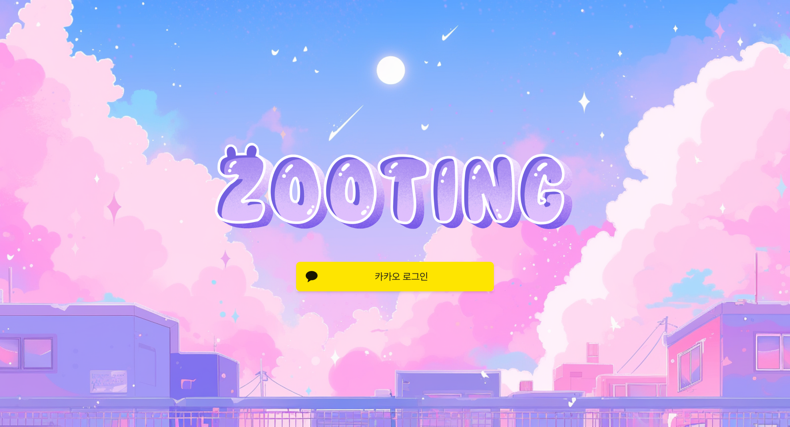

- TODO: 메인화면 왼쪽의 서비스 소개 및 튜토리얼 동영상 변경

## 회원가입

### 개인정보 입력 화면

### 동물상 분석을 위한 촬영 화면

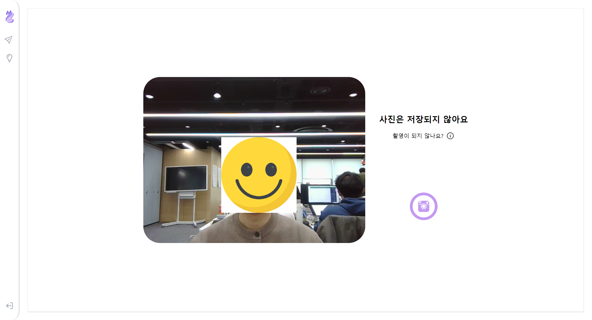

### 동물상 분석 결과 화면

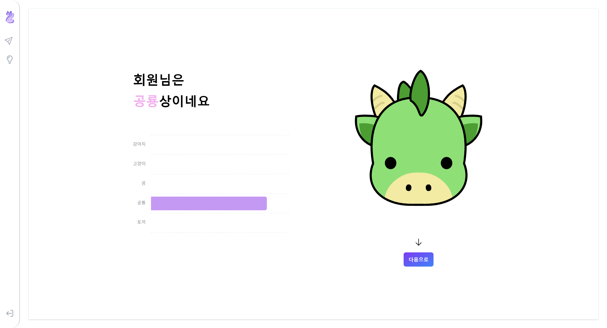

### 성격 분석 화면

### 성격 분석 결과 화면

## 메인화면

### 메인화면

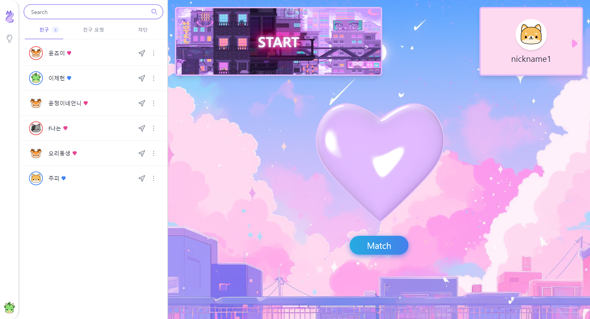

### 채팅 화면

- 접속중인 친구들과 메시지가 도착했는지를 확인할 수 있어요.
  

### 매칭 대기화면

- 매칭중인 화면
  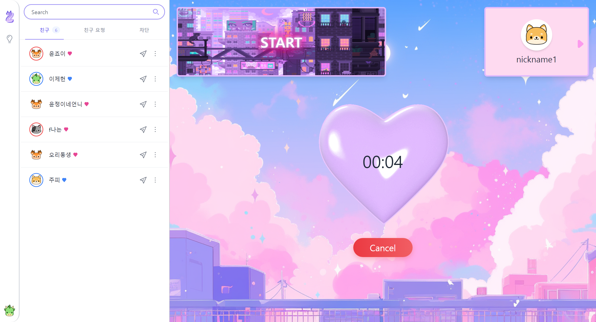

- 매칭 완료된 화면
  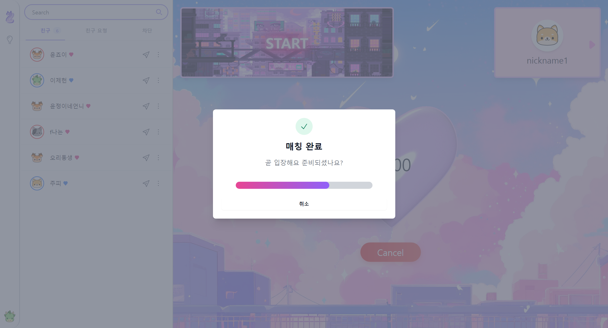

- 매칭 대기중 미니게임
  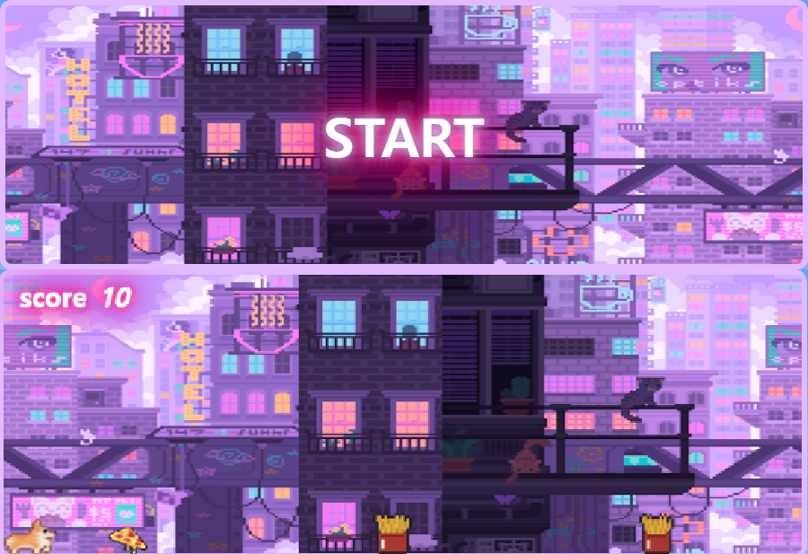

## 마이페이지

### 유저 정보 표시 페이지

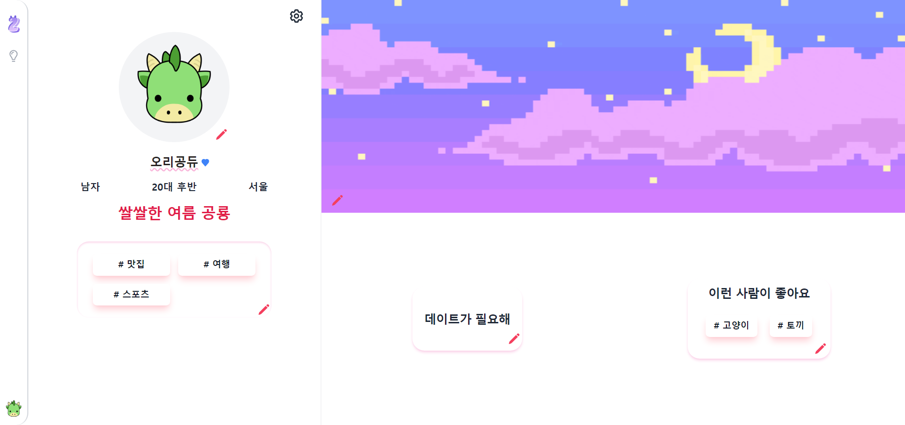

### 내 정보 수정 페이지

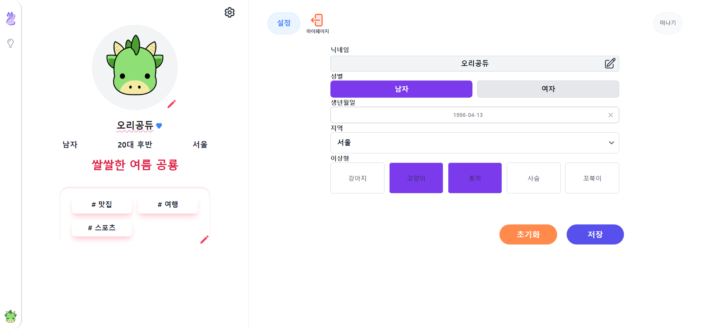

### 동물상 선택 페이지

- 마스크 구매 및 변경
  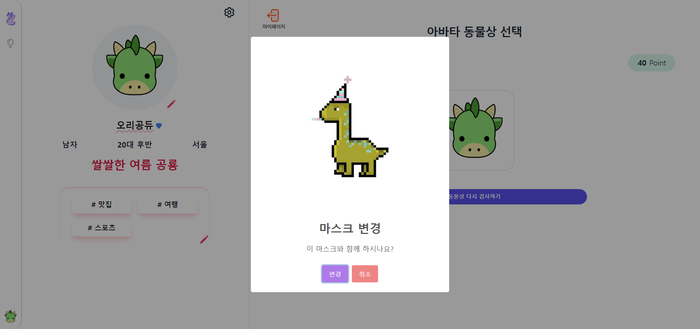

### 이상형 관심사 수정 페이지

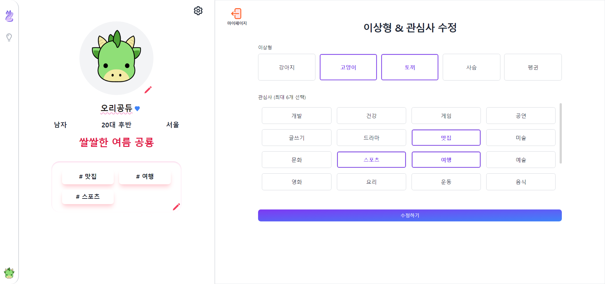

### 배경 구매 화면

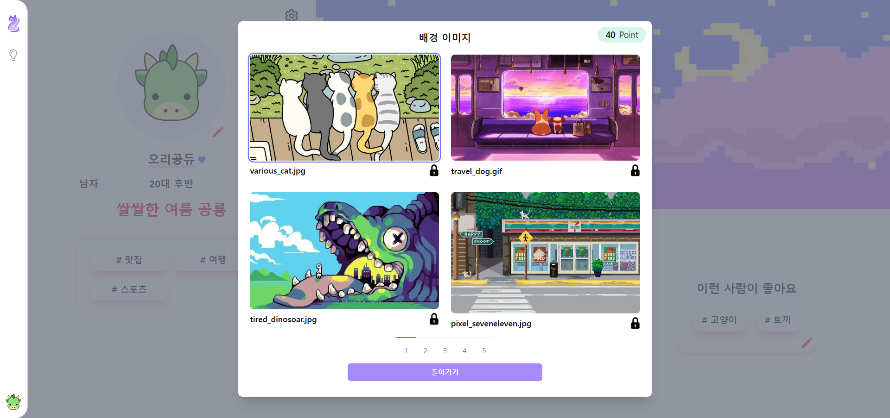
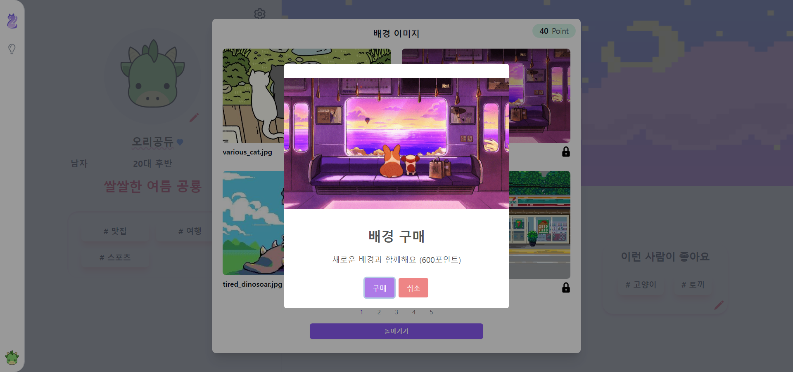

## 미팅 화면

// TODO

### 가면 착용중인 나의 화면 예시

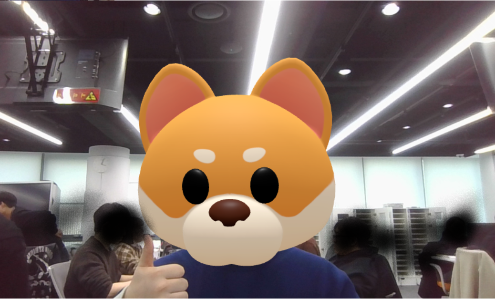

### 화상 미팅중 화면 예시

// TODO
.png>)

### 캐치마인드 등 미니게임 화면 예시

// TODO
.png>)

---

# 🐱‍🐉 기술 스택

## 1. WebRTC

### WebRTC란?

WebRTC (Web Real-Time Communication)는 웹 브라우저 간에 플러그인의
도움 없이 서로 통신할 수 있도록 설계된 API 입니다. 음성 통화, 영상 통화,
P2P 파일 공유 등으로 활용될 수 있습니다.

### openvidu

무료 오픈 소스 멀티 플랫폼 화상 회의 솔루션으로, 모든 하위 수준의 작업들을 래핑함으로써 사용자로 하여금 WebRTC를 보다 간단하게 적용할 수 있게 합니다. Zooting은 Openvidu를 통해 화상 시스템을 구축합니다.

## 2. Web Socket

Websocket이란 ws 프로토콜을 기반으로 클라이언트와 서버 사이에 지속적인 양방향 연결 스트림을 만들어주는 기술입니다. 이는 stateless한 성질을 가지는 HTTP 일부 통신의 한계를 극복해 주는 것으로 서버는 클라이언트에 데이터를 실시간으로 전달할 수 있게 됩니다.

### 적용

- 친구와의 실시간 통신을 통한 채팅 기능
- 멤버의 online/offline 체크를 위해 Redis와 연동하여 사용

## 3. Face Landmark Detection

> MediaPipe의 Face Landmark Detection은 실시간으로 468개의 3D 얼굴 랜드마크를 추정하는 얼굴 형상 솔루션입니다. ML 기술을 사용하여 단일 카메라가 화면 좌표 공간에서 3D표면 현상을 유추하므로 전용 센서가 필요 없습니다. 또한 지오메트리 파이프라인, GPU가속, 경량 모델 아키텍처 등을 활용하여 실시간으로 엄청난 성능을 낼 수 있습니다.

## 4. Three js

> Three.js는 웹 브라우저에서 3차원 컴퓨터 그래픽스 애니메이션 응용을 만들고 표현하기 위해 사용되는 자바스크립트 라이브러리입니다. 바닐라 자바스크립트 만으로도 웹에서 3D를 구현할 수 있으며 Zooting은 3D 동물상 가면을 Three.js를 통해 렌더하고 추출한 얼굴 랜드마크를 기반으로 가면의 동작 및 위치를 결정하게 됩니다.

## 5. Redis

> Redis는 주로 애플리케이션 캐시나 빠른 응답 속도를 가진 데이터베이스로 사용되는 오픈 소스 인메모리 NoSQL 저장소 입니다.

### 적용

- 로그인시 사용되는 Refresh-token을 저장하기 위해서 사용하였으며 보안성을 강화하기 위해서 엑세스 토큰 갱신시에 리프레시 토큰도 같이 갱신되는 `Refresh Token Rotation` 방식을 채용하였습니다.
- 미팅 매칭을 위해서 회원이 대기하는 중 대기 및 미팅 참여를 위한 회원을 관리하기 위한 용도로 사용
- 멤버의 online/offline 상태를 관리하기 위해서 WebSocket과 연동해서 사용

---

## 🦝 시퀸스 다이어그램

### DM (채팅) 시퀸스

### 친구 요청 시퀸스

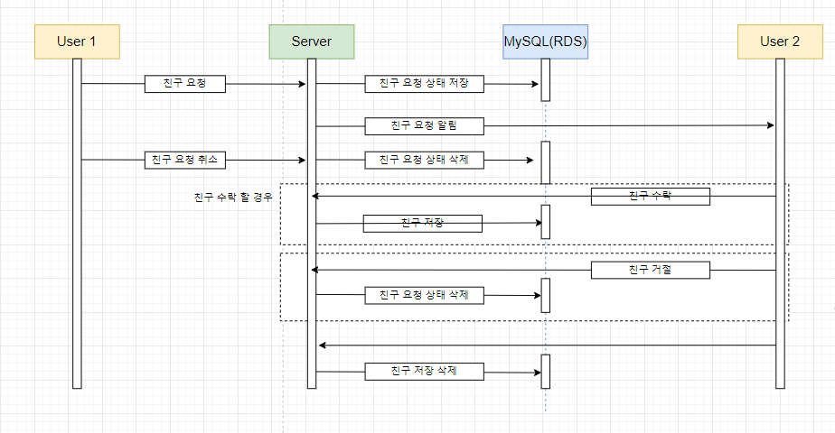

### 회원 가입 및 로그인 시퀸스

### 화상 매칭 관련 시퀸스

---

# 🐰 프로젝트 일정 및 산출물

## 프로젝트 진행

## 1. Git flow

Git flow 사용을 위해 `sourcetree` 프로그램을 사용하였고 `git convention`을 지켜가며 프로젝트 개발에 임하였습니다.

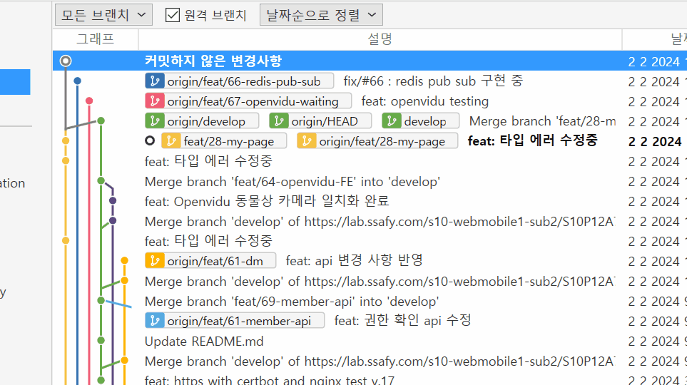

## 프로젝트 산출물

### 1. Figma

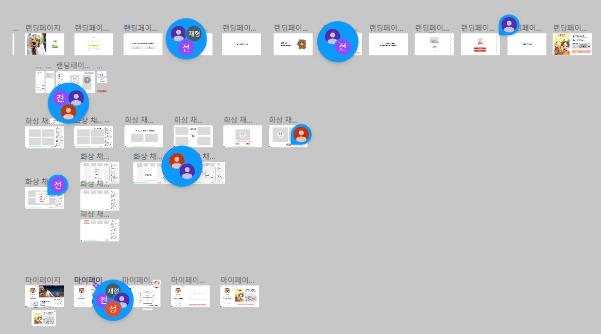

### 2. ERD

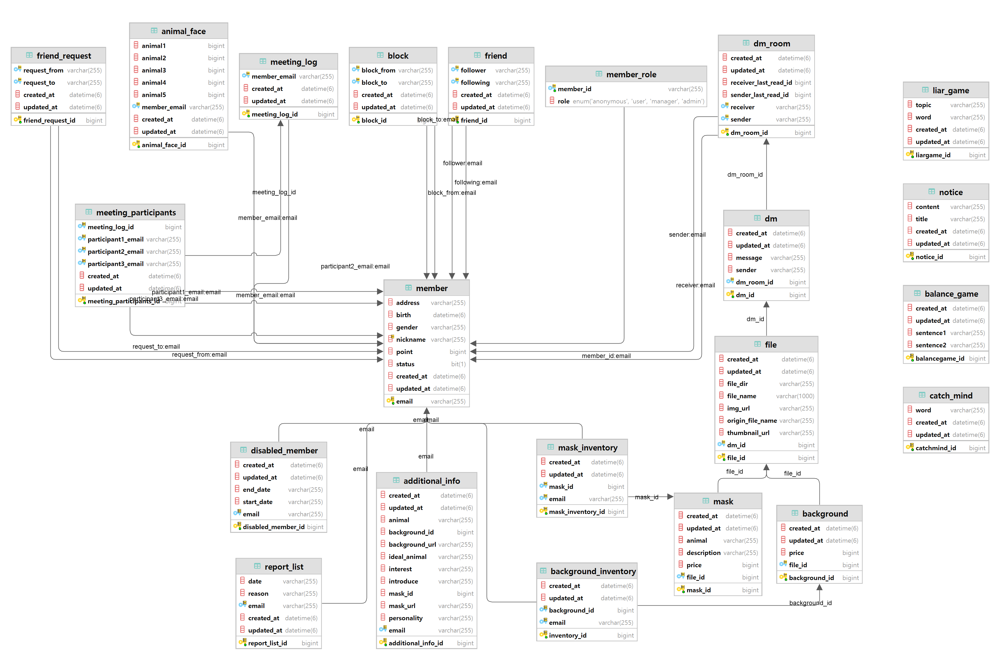

### 3. API 문

### 4. Gitlab 이슈 관리를 통한 기능 구현

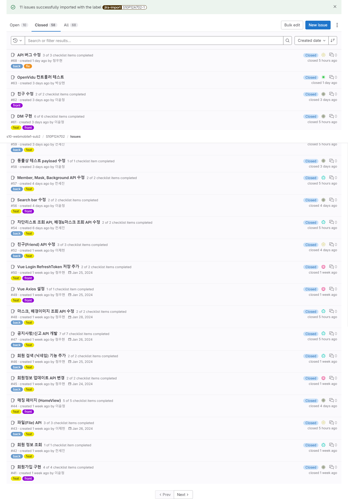
