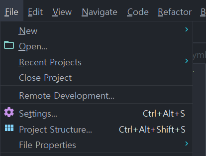
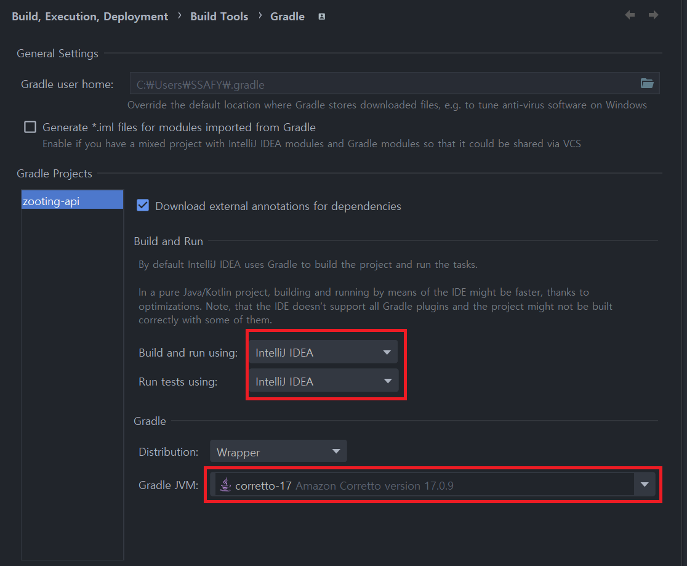
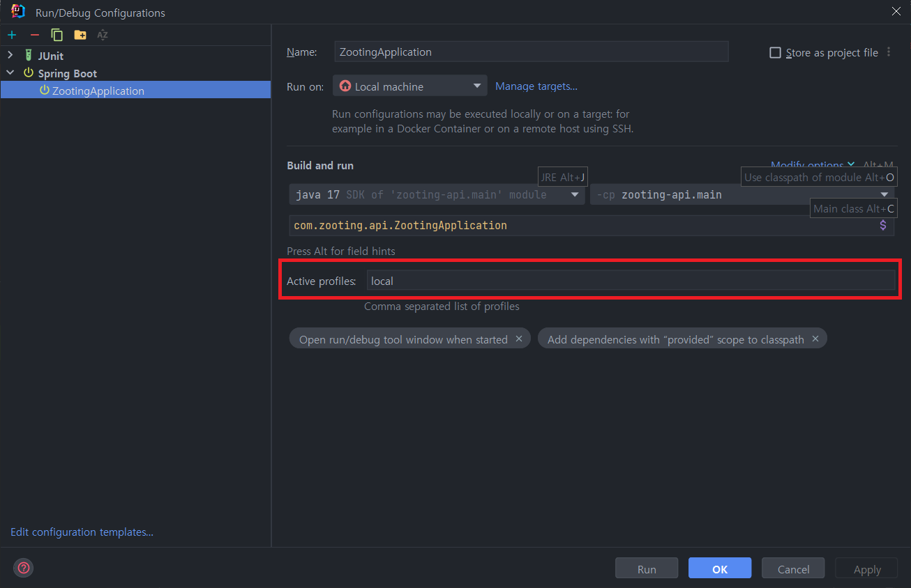
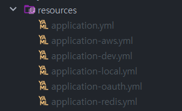
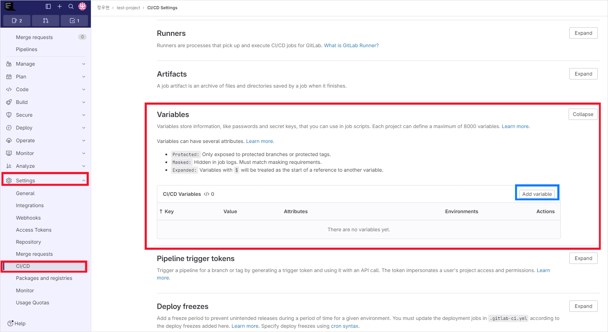
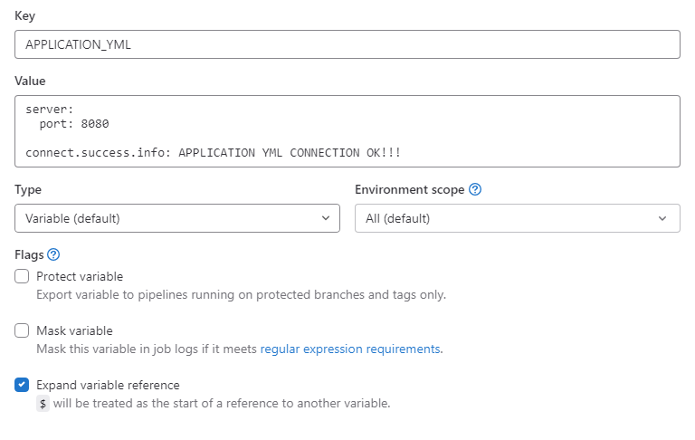
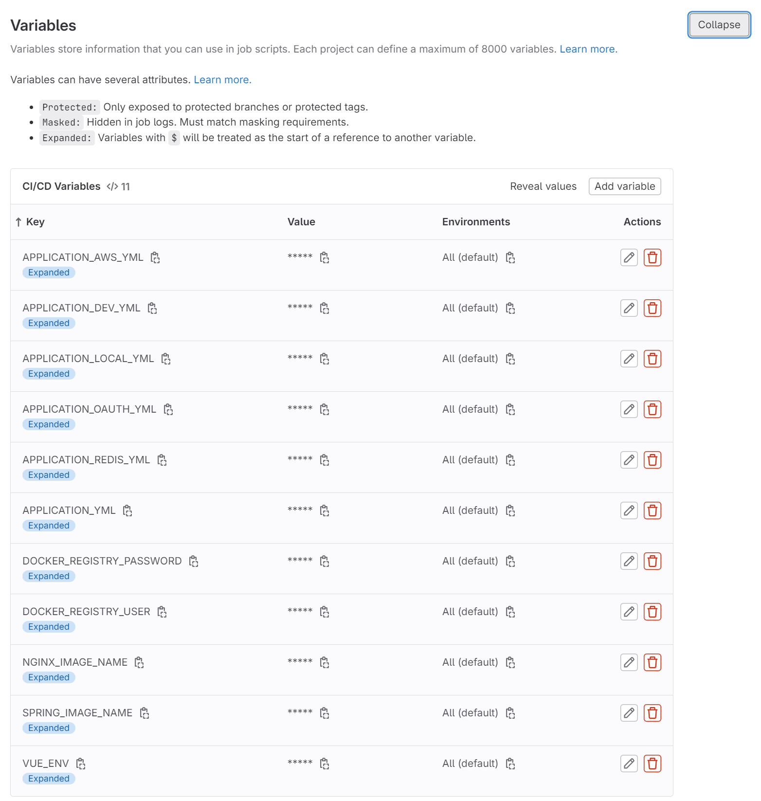

# 포팅 가이드라인

이 문서는 `Zooting` 서비스 `Front`, `Back`, `Infra`의 빌드 및 배포를 위한 문서입니다.

# 프로젝트 버전 정보

| 공통     | 형상관리      | Gitlab                  | -        |
| -------- | ------------- | ----------------------- | -------- |
|          | 이슈관리      | Gitlab                  | -        |
|          | 커뮤니케이션  | Mattermost, Notion      | -        |
| 개발툴   | IDE           | Intellij                | 2023.2.5 |
|          |               | Vscode                  | 1.85.1   |
|          |               | Webstorm                | 2023.3.2 |
| Backend  | Java          | Amazon-correto          | 17       |
|          | Spring        | Spring boot             | 3.2.1    |
|          |               | OAuth2                  | 6.2.1    |
|          |               | Cloud-AWS               | 2.2.6    |
|          | Build         | Gradle                  | 8.5      |
|          | Cloud Storage | AWS S3                  | -        |
|          | API Docs      | Swagger3-Springdoc      | 2.0.2    |
|          | Openvidu      | Openvidu-java           | 2.29.0   |
| Frontend | Node          | Node                    | 20.10.0  |
|          |               | Npm                     | 10.4.0   |
|          | Vue           | Vue                     | 5.0.8    |
|          |               | Pinia                   | 2.1.7    |
|          | WebRTC        | openvidu-browser        | 2.29.1   |
|          | WebSocket     | Stomp                   | 2.3.3    |
|          | API 연동      | Axios                   | 1.6.5    |
|          | 동물상 분석   | Tensorflow/tfjs         | latest   |
|          | 동물상 분석   | Teachablemachine/image  | latest   |
|          | 얼굴 인식     | Material-components-web | latest   |
|          | 얼굴 랜드마크 | es-module-shims         | 1.3.6    |
| Database | RDMBS         | MySQL (RDS)             | 8.0.35   |
|          | Redis         | Redis                   | 7.2.4    |
| Infra    | AWS-EC2       | Ubuntu                  | 20.04.6  |
|          | CI/CD         | docker                  | 25.0.0   |
|          |               | docker-compose          | 2.21.0   |
|          |               | gitlab-runner           | 16.8.0   |

---

# Front 배포 설정

- 배포 환경은 `Ubuntu 20.04.6`을 사용합니다.

## HTTPS 인증 (Certbot)

docker nginx를 사용하기 전에 https 인증을 위해서 일단 nginx를 설치하고 https 인증 이후 삭제합니다.

1. Certbot 설치

   ```bash
   $ apt-get update
   $ sudo apt-get install certbot
   $ apt-get install python-certbot-nginx
   ```

2. NGINX SSL 설정

   ```bash
   server {
       listen 80 default_server;
       listen [::]:80 default_server;
       root /var/www/html;
       server_name {{domain_name}} # ex) i10a702.p.ssafy.io;
   }
   ```

3. Nginx 재시작

   ```bash
   $ sudo service nginx restart
   ```

4. SSL 인증서 받기

   ```bash
   sudo certbot --nginx -d {{domain_name}} -d {{sub_domain_name}}
   ```

   인증서 인증시 개인 이메일이 필요합니다.

5. 로컬 Nginx 완전 삭제

   ```bash
   sudo apt-get -y remove --purge nginx nginx-full nginx-common
   ```

   인증 완료 후 docker nginx 사용을 위해서 nginx를 완전히 삭제해 줍니다.

## Docker Nginx 설정

Docker Nginx 설정 파일은 프로젝트 `zooting/nginx/nginx.conf` 에 위치해 있습니다.

```bash
user  nginx;
worker_processes  auto;
error_log  /var/log/nginx/error.log warn;
pid        /var/run/nginx.pid;
events {
    worker_connections  1024;
}

http {
    include       /etc/nginx/mime.types;
    default_type  application/octet-stream;

		# server로 들어온 요청을 docker container로 넘김
    upstream springboot {
        server {{docker_container_name:port}} # ex) zooting-api:8080;
        keepalive 1024;
    }

		# 80 포트로 들어온 요청을 443 포트로 리다이렉트
    server {
        listen 80;
        server_name {{domain-name}} # 발급한 도메인 주소 ex) i10a702.p.ssafy.io;
        server_tokens off;

        # 모든 http(80포트) 요청을 https로 리다이렉팅
        location / {
            return 301 https://$host$request_uri;
        }
    }

    server {
        listen 443 ssl;
        server_name {{domain_name}} # 발급한 도메인 주소 ex) i10a702.p.ssafy.io;
        server_tokens off;

				# HTTPS 인증을 위한 Certbot 설정
        ssl_certificate /etc/letsencrypt/live/{{domain_name}}/fullchain.pem; # managed by Certbot
        ssl_certificate_key /etc/letsencrypt/live/{{domain_name}}/privkey.pem; # managed by Certbot
        include /etc/letsencrypt/options-ssl-nginx.conf; # managed by Certbot
        ssl_dhparam /etc/letsencrypt/ssl-dhparams.pem; # managed by Certbot

				# / 로 들어온 요청을 Front 페이지로 연결
        location / {
            root /usr/share/nginx/html;
            index index.html;
            try_files $uri $uri/ /index.html;

            proxy_set_header    Host                $http_host;
            proxy_set_header    X-Real-IP           $remote_addr;
            proxy_set_header    X-Forwarded-For     $proxy_add_x_forwarded_for;
        }
				# 아래의 주소에 대한 요청을 Back으로 연결
        location ~ ^/(api|oauth2|login/oauth2) {
            proxy_pass  http://springboot;
            proxy_set_header    Host                $http_host;
            proxy_set_header    X-Real-IP           $remote_addr;
            proxy_set_header    X-Forwarded-For     $proxy_add_x_forwarded_for;
        }
				# 아래의 주소에 대한 요청을 Back으로 연결하고 소켓 연결로 업그레이드
        location /ws {
            proxy_pass http://springboot;
            proxy_http_version 1.1;
            proxy_set_header    Upgrade             $http_upgrade;
            proxy_set_header    Connection          'upgrade';
            proxy_set_header    Host                $host;
                    proxy_cache_bypass  $http_upgrade;
        }
				# Swagger 요청에 대해서 Back으로 연결
        location ~ ^/(swagger|webjars|configuration|swagger-resources|v2|csrf) {
                   proxy_pass http://springboot;
                   proxy_set_header Host $host;
                   proxy_set_header X-Real-IP $remote_addr;
                   proxy_set_header X-Forwarded-For $proxy_add_x_forwarded_for;
                   proxy_set_header X-Forwarded-Proto $scheme;
        }
    }
		# nginx log에 대한 포맷 설정
    log_format timed_combined '$remote_addr - $remote_user [$time_local] '
            '"$request" $status $body_bytes_sent '
            '"$http_referer" "$http_user_agent" '
            'rt $request_time urt $upstream_response_time';

    access_log /var/log/nginx/access.log timed_combined;

    sendfile        on;
    keepalive_timeout  65;
}
```

백엔드 docker container 이름, 도메인 이름을 자신의 서버 환경에 맞게 변경해 줍니다.

## Dockerfile 설정

Front 빌드 및 배포를 위한 도커 파일은 프로젝트내 `zooting/Dockerfile` 에 위치하여 있습니다.

```docker
FROM node:20.10.0-alpine as build-stage
WORKDIR /app
COPY package*.json ./

RUN rm -rf node_modules package-lock.json
RUN npm install

COPY ./ .
RUN npm run build-only

FROM nginx:stable-alpine as production-stage
COPY --from=build-stage /app/dist /usr/share/nginx/html
COPY ./nginx/nginx.conf /etc/nginx/nginx.conf
EXPOSE 80
CMD ["nginx", "-g", "daemon off;"]
```

## .env 파일 추가

`gitlab-runner`을 이용하여 `CI/CD`를 구성할 경우 `Variables`에 등록

- `.env`파일 작성
  ```bash
  VITE_SERVER_API_URL={{ domain-address }} # ex) https://i10a702.p.ssafy.io
  ```

---

# Backend 빌드 및 배포 설정

## 빌드 설정

프로젝트 빌드를 위한 `intellij` 설정 입니다.



1. SDK 및 language level 설정
   1. `File` → `Project Structure` → `Project`
   2. `SDK`에 `corretto-17`을 설정
   3. `language level`을 `17 - Sealed types`로 설정
2. Gradle 설정

   1. `File` → `Settings` → `Build, Execution, Deployment` → `Build Tools` → `Gradle`
   2. 다음과 같이 설정

      

## 배포 설정

`prod`, `dev`, `local`세가지의 프로필로 나누어서 프로젝트를 진행 하였습니다.

- intellij에서 프로필 설정을 위해서 `Active profiles`에 프로필을 지정 주어야 합니다. (default: `prod`)
  

### resources 폴더 구조



### 서버 yml 파일 설정

`{{ name }}`안의 내용을 사용자 환경에 맞게 수정하시면 됩니다.

파일경로: `zooting-api/src/main/resources/{{yml-name}}.yml`

- **application.yml (prod 환경)**

  ```yaml
  server:
    port: 8080

  spring:
    h2:
      console:
        enabled: false
        path: /h2-console
    data:
      jdbc:
        repositories:
          enabled: false
      redis:
        repositories:
          enabled: false
    datasource:
      url: jdbc:mysql://{{mysql-address}}?serverTimezone=UTC&useUniCode=yes&characterEncoding=UTF-8
      username: { { mysql-username } }
      password: { { mysql-password } }
      driver-class-name: com.mysql.cj.jdbc.Driver
    jpa:
      hibernate:
        ddl-auto: none
      show-sql: false
      properties:
        hibernate:
          format_sql: true
      defer-datasource-initialization: true
      generate-ddl: true
    mvc:
      pathmatch:
        matching-strategy: ant_path_matcher
    profiles:
      group:
        prod:
          - prod
          - oauth
        dev:
          - dev
          - oauth
        local:
          - local
          - oauth
      active: prod
      include:
        - aws
        - redis

  #JWT
  jwt:
    secretKey: { { jwt-key } }
    access-token-expiration: 1800 # 30분: 1800
    refresh-token-expiration: 1209600 # 14일
    issuer: { { service-name } } # Zooting

  # 유저의 online 상태를 확인 하는 주기 (second)
  heartbeat:
    interval:
      time: 15

  # Social Redirect Url
  client:
    redirect-url:
      success: { { domain-address } } # ex) https://i10a702.p.ssafy.io/login
      anonymous: { { domain-address } } # ex) https://i10a702.p.ssafy.io/login
      fail: { { domain-address } } # ex) https://i10a702.p.ssafy.io/signin

  logging:
    level:
      root: info

  openvidu:
    url: { { openvidu-address:port-number } } # ex) https://i10a702.p.ssafy.io:8082
    secret: { { openvidu-secretk-key } } # ex) tkdadsflafmsxla

  springdoc:
    api-docs:
      path: /api-docs
      groups:
        enabled: true
    swagger-ui:
      path: /swagger-ui.html
      enabled: true
      groups-order: asc
      tags-sorter: alpha
      operations-sorter: alpha
      display-request-duration: true
      doc-expansion: none
    cache:
      disabled: true
    override-with-generic-response: false
    model-and-view-allowed: false
    default-consumes-media-type: application/json
    default-produces-media-type: application/json
    group-configs:
      - group: all-api
        paths-to-match:
          - /**
        paths-to-exclude:
          - /favicon.ico
          - /health
      - group: jwt-api
        paths-to-match:
          - /api/**
    show-actuator: true
  ```

- **application-dev.yml (dev 환경)**

  ```yaml
  server:
    port: 8080

  spring:
    h2:
      console:
        enabled: false
        path: /h2-console
    data:
      jdbc:
        repositories:
          enabled: false
      redis:
        repositories:
          enabled: false
    datasource:
      url: jdbc:mysql://{{mysql-address}}?serverTimezone=UTC&useUniCode=yes&characterEncoding=UTF-8
      username: {{mysql-username}}
      password: {{mysql-password}}
      driver-class-name: com.mysql.cj.jdbc.Driver
    jpa:
      hibernate:
        ddl-auto: update
      show-sql: true
      properties:
        hibernate:
          format_sql: true
      defer-datasource-initialization: true
      generate-ddl: true
    mvc:
      pathmatch:
        matching-strategy: ant_path_matcher
  	config:
  		activate:
  			on-profile: dev

  #JWT
  jwt:
    secretKey: {{ jwt-key }}
    access-token-expiration: 180000 # 50 시간
    refresh-token-expiration: 1209600 # 14일
    issuer: {{ service-name }} # Zooting

  # 유저의 online 상태를 확인 하는 주기 (second)
  heartbeat:
    interval:
      time: 60

  # Social Redirect Url
  client:
    redirect-url:
      success: http://localhost:5173/login
      anonymous: http://localhost:5173/login
      fail: http://localhost:5173/login

  logging:
    level:
      root: trace

  openvidu:
    url: {{ openvidu-address:port-number }} # ex) https://i10a702.p.ssafy.io:8082
    secret: {{ openvidu-secretk-key }} # ex) tkdadsflafmsxla

  springdoc:
    api-docs:
      path: /api-docs
      groups:
        enabled: true
    swagger-ui:
      path: /swagger-ui.html
      enabled: true
      groups-order: asc
      tags-sorter: alpha
      operations-sorter: alpha
      display-request-duration: true
      doc-expansion: none
    cache:
      disabled: true
    override-with-generic-response: false
    model-and-view-allowed: false
    default-consumes-media-type: application/json
    default-produces-media-type: application/json
    group-configs:
      - group: all-api
        paths-to-match:
          - /**
        paths-to-exclude:
          - /favicon.ico
          - /health
      - group: jwt-api
        paths-to-match:
          - /api/**
    show-actuator: true
  ```

- **application-local.yml (local 환경)**

  ```yaml
  server:
    port: 8080

  spring:
    h2:
      console:
        enabled: false
        path: /h2-console
    data:
      jdbc:
        repositories:
          enabled: false
      redis:
        repositories:
          enabled: false
    datasource:
      url: jdbc:mysql://127.0.0.1:3306/test?serverTimezone=UTC&useUniCode=yes&characterEncoding=UTF-8
      username: ssafy
      password: ssafy
      driver-class-name: com.mysql.cj.jdbc.Driver
    jpa:
      hibernate:
        ddl-auto: update
      show-sql: true
      properties:
        hibernate:
          format_sql: true
      defer-datasource-initialization: true
      generate-ddl: true
    mvc:
      pathmatch:
        matching-strategy: ant_path_matcher
    config:
      activate:
        on-profile: local

  #JWT
  jwt:
    secretKey: { { jwt-key } }
    access-token-expiration: 180000 # 50 시간
    refresh-token-expiration: 1209600 # 14일
    issuer: { { service-name } } # Zooting

  heartbeat:
    interval:
      time: 60

  # Social Redirect Url
  client:
    redirect-url:
      success: http://localhost:5173/login
      anonymous: http://localhost:5173/login
      fail: http://localhost:5173/signin

  logging:
    level:
      root: trace

  openvidu:
    url: { { openvidu-address:port-number } } # ex) https://i10a702.p.ssafy.io:8082
    secret: { { openvidu-secretk-key } } # ex) tkdadsflafmsxla

  springdoc:
    api-docs:
      path: /api-docs
      groups:
        enabled: true
    swagger-ui:
      path: /swagger-ui.html
      enabled: true
      groups-order: asc
      tags-sorter: alpha
      operations-sorter: alpha
      display-request-duration: true
      doc-expansion: none
    cache:
      disabled: true
    override-with-generic-response: false
    model-and-view-allowed: false
    default-consumes-media-type: application/json
    default-produces-media-type: application/json
    group-configs:
      - group: all-api
        paths-to-match:
          - /**
        paths-to-exclude:
          - /favicon.ico
          - /health
      - group: jwt-api
        paths-to-match:
          - /api/**
    show-actuator: true
  ```

- **application-oauth.yml**

  ```yaml
  spring:
    security:
      oauth2:
        client:
          registration:
            kakao:
              client-id: {{ kakao-develop-restapi-key }}
              client-secret: {{ kakao-develop-restapi-key }}
              redirect-uri: {{ domain-address }}/login/oauth2/code/kakao # https://i10a702.p.ssafy.io/login/oauth2/code/kakao
              client-authentication-method: client_secret_post
              authorization-grant-type: authorization_code
              scope: account_email
              client-name: Kakao
          provider:
            kakao:
              authorization_uri: https://kauth.kakao.com/oauth/authorize
              token_uri: https://kauth.kakao.com/oauth/token
              user-info-uri: https://kapi.kakao.com/v2/user/me
              user_name_attribute: id
    config:
      activate:
        on-profile: prod, dev

  ---
  spring:
    security:
      oauth2:
        client:
          registration:
            kakao:
              client-id: {{ kakao-develop-restapi-key }}
              client-secret: {{ kakao-develop-restapi-key }}
              redirect-uri: http://localhost:8080/login/oauth2/code/kakao
              client-authentication-method: client_secret_post
              authorization-grant-type: authorization_code
              scope: account_email
              client-name: Kakao
          provider:
            kakao:
              authorization_uri: https://kauth.kakao.com/oauth/authorize
              token_uri: https://kauth.kakao.com/oauth/token
              user-info-uri: https://kapi.kakao.com/v2/user/me
              user_name_attribute: id
    config:
      activate:
        on-profile: local
  ```

- **application-aws.yml**

  ```yaml
  spring:
    config:
      activate:
        on-profile: prod, dev, local

  cloud:
    aws:
      credentials:
        access-key: { { aws-s3-access-key } }
        secret-key: { { aws-s3-secret-key } }
      s3:
        bucket: { { aws-s3-bucket-name } }
      region:
        static: { { aws-s3-region } }
      stack:
        auto: false
  ```

  키 발급 방법

  1. AWS에 가입
  2. IAM 사용자로 S3FullAccess 권한을 부여한 사용자를 생성
  3. 해당 사용자의 계정으로 접속하여 키 발급

- **application-redis.yml**
  ```yaml
  spring:
    data:
      redis:
        host: 127.0.0.1
        port: 6379
        lettuce:
          pool:
            max-active: 5 # pool에 할당될 수 있는 커넥션 최대수
            max-idle: 5 # pool의 'idle' 커넥션 최대수
            min-idle: 2
    config:
      activate:
        on-profile: local
  ---
  spring:
    data:
      redis:
        host: { { docker-redis-container-name } } # ex) zooting-redis
        port: 6379
        lettuce:
          pool:
            max-active: 5 # pool에 할당될 수 있는 커넥션 최대수
            max-idle: 5 # pool의 'idle' 커넥션 최대수
            min-idle: 2
    config:
      activate:
        on-profile: prod, dev
  ```

### Dockerfile 설정

Back 빌드 및 배포를 위한 도커 파일은 프로젝트내 `zooting-api/Dockerfile` 에 위치하여 있습니다.

```docker
FROM amazoncorretto:17

# 인자 설정 - JAR_File
ARG JAR_FILE=build/libs/zooting-api-0.0.1-SNAPSHOT.jar

# 인자 설정 부분과 jar 파일 복제 부분 합쳐서 진행해도 무방
COPY ${JAR_FILE} zooting-api.jar

# 실행 명령어
ENTRYPOINT ["java","-Djava.security.egd=file:/dev/./urandom","-jar","/zooting-api.jar", "--spring.profiles.active=prod"]
```

- **Dockerfile 배포 환경 설정**

배포 환경 (`prod`, `dev`, `local`)에 맞추어 변경이 필요합니다..

`"--spring.profiles.active=prod"`

---

# Openvidu 배포 설정

[On premises - OpenVidu Docs](https://docs.openvidu.io/en/2.29.0/deployment/ce/on-premises/)

## Openvidu 설치

1. Openvidu 배포를 위해 root permission 부여

   ```bash
   $ sudo su
   ```

2. /opt로 이동 후 Openvidu 설치

   ```bash
   $ cd /opt
   $ curl https://s3-eu-west-1.amazonaws.com/aws.openvidu.io/install_openvidu_latest.sh | bash
   ```

3. /opt/openvidu로 이동 후 .env파일 설정

   ```bash
   $ cd openvidu
   $ vi .env
   ```

4. .env파일 설정

   ```bash
   # OpenVidu configuration
   # ----------------------
   # Documentation: https://docs.openvidu.io/en/stable/reference-docs/openvidu-config/

   # NOTE: This file doesn't need to quote assignment values, like most shells do.
   # All values are stored as-is, even if they contain spaces, so don't quote them.

   # Domain name. If you do not have one, the public IP of the machine.
   # For example: 198.51.100.1, or openvidu.example.com
   DOMAIN_OR_PUBLIC_IP=i10a702.p.ssafy.io

   # OpenVidu SECRET used for apps to connect to OpenVidu server and users to access to OpenVidu Dashboard
   OPENVIDU_SECRET=YOUR_SECRET #Secret Key는 커스터미이징

   # Certificate type:
   # - selfsigned:  Self signed certificate. Not recommended for production use.
   #                Users will see an ERROR when connected to web page.
   # - owncert:     Valid certificate purchased in a Internet services company.
   #                Please put the certificates files inside folder ./owncert
   #                with names certificate.key and certificate.cert
   # - letsencrypt: Generate a new certificate using letsencrypt. Please set the
   #                required contact email for Let's Encrypt in LETSENCRYPT_EMAIL
   #                variable.

   #certbot으로 발급한 인증서를 사용 예정이므로 별도의 인증 수단 사용 X
   #selfsigned로 사용시 별도로 인증 과정 X
   CERTIFICATE_TYPE=selfsigned

   # If CERTIFICATE_TYPE=letsencrypt, you need to configure a valid email for notifications
   LETSENCRYPT_EMAIL=

   # Proxy configuration
   # If you want to change the ports on which openvidu listens, uncomment the following lines

   # Allows any request to http://DOMAIN_OR_PUBLIC_IP:HTTP_PORT/ to be automatically
   # redirected to https://DOMAIN_OR_PUBLIC_IP:HTTPS_PORT/.
   # WARNING: the default port 80 cannot be changed during the first boot
   # if you have chosen to deploy with the option CERTIFICATE_TYPE=letsencrypt

   # Openvidu의 기본 포트를 http = 8081, https = 8082로 변경
   HTTP_PORT=8081

   # Changes the port of all services exposed by OpenVidu.
   # SDKs, REST clients and browsers will have to connect to this port
   HTTPS_PORT=8082
   ```

## Openvidu Nginx 설정

1. openvidu 내장 nginx 설정을 위해 /opt/openvidu/custom-nginx-vhosts로 이동

   ```bash
   $ cd custom-nginx-vhosts
   ```

2. custom-zooting.conf 재설정

   ```bash
   server {
           if ($host = i10a702.p.ssafy.io) {
                   return 308 https://$host$request_uri;
           }

           listen 8081;
           server_name i10a702.p.ssafy.io;
           return 404;
   }

   server {
   				# 8082 포트로 들어오는 https 요청을 listen
           listen 8082 ssl;
           server_name i10a702.p.ssafy.io;

   				# certbot을 통해 발급받은 인증서 사용
           ssl_certificate /etc/letsencrypt/live/i10a702.p.ssafy.io/fullchain.pem; # managed by Certbot
           ssl_certificate_key /etc/letsencrypt/live/i10a702.p.ssafy.io/privkey.pem; # managed by Certbot

   				# websocket 이용을 위한 http upgrade
           location / {
                   proxy_pass https://i10a702.p.ssafy.io:8082;
                   proxy_http_version 1.1;
                   proxy_set_header Upgrade $http_upgrade;
                   proxy_set_header Connection 'upgrade';
                   proxy_set_header Host $host;
                   proxy_cache_bypass $http_upgrade;
               }
   }
   ```

### Nginx 설정을 이용해 docker-compose 수정

1. 인증서 override를 위해 docker volume override (/opt/openvidu/docker-compose.override.yml)

   ```yaml
   services:
       # --------------------------------------------------------------
       #
       #    Change this if your want use your own application.
       #    It's very important expose your application in port 5442
       #    and use the http protocol.
       #
       #    Default Application
       #
       #    Openvidu-Call Version: 2.29.0
       #
       # --------------------------------------------------------------
       app:
           image: openvidu/openvidu-call:2.29.0
           restart: on-failure
           network_mode: host
           environment:
               - SERVER_PORT=5442
               - OPENVIDU_URL=http://localhost:5443
               - OPENVIDU_SECRET=${OPENVIDU_SECRET}
               - CALL_OPENVIDU_CERTTYPE=${CERTIFICATE_TYPE}
               - CALL_PRIVATE_ACCESS=${CALL_PRIVATE_ACCESS:-}
               - CALL_USER=${CALL_USER:-}
               - CALL_SECRET=${CALL_SECRET:-}
               - CALL_ADMIN_SECRET=${CALL_ADMIN_SECRET:-}
               - CALL_RECORDING=${CALL_RECORDING:-}
           logging:
               options:
                   max-size: "${DOCKER_LOGS_MAX_SIZE:-100M}"
       nginx:
           volumes:
   						#인증서 override를 위해 docker volume override (docker-compose.override.yml)
               - /etc/letsencrypt:/etc/letsencrypt
   ```

2. application.yml 수정

   ```yaml
   # custom conf에서 설정한 서버 이름, 포트
   # 사용자 지정 secret

   openvidu:
     url: https://i10a702.p.ssafy.io:8082
     secret: YOUR_SECRET
   ```

---

# Server 설정

## docker 설치

1. 우분투 시스템 패키지 업데이트

   ```bash
   $ sudo apt-get update
   ```

2. 도커 설치에 필요한 패키지 설치

   ```bash
   $ sudo apt-get install apt-transport-https ca-certificates curl gnupg-agent software-properties-common
   ```

3. Docker 공식 GPG 설치

   ```bash
   $ curl -fsSL <https://download.docker.com/linux/ubuntu/gpg> | sudo apt-key add -
   ```

4. Docker의 공식 apt 저장소를 추가

   ```bash
   $ sudo add-apt-repository "deb [arch=amd64] <https://download.docker.com/linux/ubuntu> $(lsb_release -cs) stable"
   ```

5. 시스템 패키지 업데이트

   ```bash
   $ sudo apt-get update
   ```

6. Docker 설치

   ```bash
   $ sudo apt-get install docker-ce docker-ce-cli containerd.io
   ```

7. Docker 설치 확인

   ```bash
   $ sudo systemctl status docker
   $ docker -v
   ```

## docker-compose 설치

1. Docker-compose 설치

   ```bash
   $ sudo curl -SL "<https://github.com/docker/compose/releases/download/v2.23.0/docker-compose-$>(uname -s)-$(uname -m)" -o /usr/local/bin/docker-compose
   ```

   - docker-compose yml 3.0 이상을 사용할 경우 2.0.0 이상의 docker-compose를 설치해야 한다.

2. Docker-compose 권한 부여

   ```bash
   $ sudo chmod +x /usr/local/bin/docker-compose
   ```

3. Docker-compose 심볼릭 링크 지정

   ```bash
   $ sudo ln -s /usr/local/bin/docker-compose /usr/bin/docker-compose
   ```

4. docker-compose 버전 확인

   ```bash
   $ docker-compose --version
   ```

---

## docker-compose.yml 작성

프로젝트 가장 상위에 `docker-compose.yml` 파일을 생성합니다.

```yaml
version: "3"
services:
  springboot:
    container_name: {{ container-name }} # ex) zooting-api
    image: {{ docker-hub-username }}/{{ server-image:tag }} # ex) duckbill413/zooting-docker-api:latest
    ports:
      - "8080:8080"
    environment:
      TZ: "Asia/Seoul"
    networks:
      - {{ project-network }} # ex) zooting_net
    volumes:
      - /home/ec2-user/logs:/logs

  redis:
    image: redis:alpine
    container_name: {{ container-name }} # ex) zooting-redis
    command: redis-server --port 6379
    hostname: redis
    ports:
      - "6800:6379" # 포트 번호 확인
    networks:
      - {{ project-network }} # ex) zooting_net
    restart: always

  nginx:
    container_name: {{ container-name }} # ex) zooting-nginx
    image: {{ docker-hub-username }}/{{ nginx-image:tag }} # ex) duckbill413/zooting-nginx:latest
    build:
      context: ./zooting # nginx dockerfile 위치
      dockerfile: Dockerfile
    volumes:
      - /etc/letsencrypt:/etc/letsencrypt:ro # certbot 인증서 위치
    ports:
      - "80:80"
      - "443:443"
    networks:
      - {{ project-network }} # ex) zooting_net
    depends_on:
      - springboot # springboot 실행 후 nginx 실행

networks:
  zooting_net:
    driver: bridge
```

---

# EC2와 Gitlab 연결

`gitlab-runner`사용을 위해서 아래와 같이 설정합니다.

[velog](https://velog.io/@duckbill/EC2와-Gitlab-연결-ro0ne6jd)

# EC2와 Gitlab 연결

EC2와 Gitlab-Runner 연결

- Ubuntu 20.04 기준으로 진행합니다.

## Git Runner 설치

1. root 계정 접속

```bash
$ sudo su
$ sudo apt update
$ sudo apt upgrade
```

1. gitlab repository 추가

```bash
$ curl -L "<https://packages.gitlab.com/install/repositories/runner/gitlab-runner/script.deb.sh>" | sudo bash
```

1. gitlab-runner 설치

```bash
$ sudo apt install gitlab-runner
```

## Ubuntu & GitLab Runner 연결

1. GitLab 프로젝트에 들어간다.
2. GitLab → Settings → CI/CD → Runners

   

3. Runners Project Runner 생성

   

4. Project Runner 설정

   

- Ubuntu 환경에서 사용하므로 `Linux` 설정
- `Description`에는 Runner Process 이름을 설정해준다. (이름 기억!)

1. Gitlab Runner 토큰 정보 확인

   

2. Ubuntu에 gitlab-runner process 등록 하기

```bash
# gitlab-runner register 실행하기
$ sam
# gitlab instance url 설정
$ <https://lab.ssafy.com>
# gitlab token 입력
$ glrt-fS8fcAQYx1cWhDSHJfVU
# gitlab runner 이름 입력 (Tag명 입력)
$ sample
# gitlab runner을 실행시킬 executor 지정 (Docker)
$ docker
# docker 버전 지정
$ docker:20.0.7
```

1. Gitlab Runner 생성 및 연결 확인

   

2. Gitlab Runner 추가 설정 (연필 모양 버튼)

   

   - untag job을 실행하기 위해서 체크
   - description 재확인

3. gitlab-runner process 연결 확인

   

   - Gitlab Runners에 연결된 Runner 확인 가능
   - Ubuntu에서는 `gitlab-runner list`로 확인 가능

4. Gitlab Runner에 권한 설정

   GItlab Runner은 Gitlab CI를 통해서 서버에서 Docker을 실행하므로 권한이 필요

   ```bash
   $ sudo usermod -aG docker gitlab-runner
   ```

5. Gitlab CI 설정 파일 수정

   ```bash
   $ vi /etc/gitlab-runner/config.toml
   ```

   

   - `privileged: true`
   - `volumes = ["/cache", "/var/run/docker.sock:/var/run/docker.sock"]`

6. Docker 재시작

   ```bash
   $ service docker restart
   ```

---

# gitlab-ci 구성

## gitlab-ci에 환경 변수 등록하기



- 기존에 작성한 `yml` 파일, `docker-hub` 정보, `image-name`, `front-env` 파일 정보를 환경 변수로 등록해 줍니다.
  
- 환경 변수 등록 예시
  

---

## .gitlab-ci.yml 생성

프로젝트 가장 상위에 `.gitlab-ci.yml` 파일을 생성합니다.

```yaml
stages:
  - build
  - package
  - deploy

build: # JOB 이름
  # 사용될 이미지 설정
  image: gradle:8.5.0-jdk17 # gradle - java 이미지 지정
  # stage 설정
  stage: build
  # 실행될 script 설정
  script:
    - echo [INFO] YML Settings
    - cd ./zooting-api # zooting-api server 위치로 이동
    - cd ./src/main/resources # resources 폴더 위치로 이동
    - echo "$APPLICATION_YML" > "application.yml" # gitlab APPLICATION_YML을 이용하여 application.yml 파일 생성
    - echo "$APPLICATION_DEV_YML" > "application-dev.yml"
    - echo "$APPLICATION_LOCAL_YML" > "application-local.yml"
    - echo "$APPLICATION_OAUTH_YML" > "application-oauth.yml"
    - echo "$APPLICATION_REDIS_YML" > "application-redis.yml"
    - echo "$APPLICATION_AWS_YML" > "application-aws.yml"
    - ls
    - echo [INFO] spring-boot project build
    - cd ../../.. # 프로젝트 폴더로 경로 이동
    - chmod +x gradlew # gradle 권한 부여
    - ./gradlew clean
    - ./gradlew bootjar
    # - ./gradlew build
  # artifacts 설정 (bulld를 통해 생성된 파일을 job artifacts에 보관하여 다음에 수행되는 JOB에서 가져다 활용할 수 있게 도와줌)
  artifacts:
    # 보관이 이루어질 경로 설정
    paths:
      - zooting-api/build/libs/zooting-api-0.0.1-SNAPSHOT.jar # Dockerfile에 지정한 경로로 지정
    # 유효기간 설정
    expire_in: 1 days
  # JOB이 수행될 branch 설정 (설정된 branch에 push가 발생될 시 JOB 수행)
  only:
    - master
    - release
    - develop

package:
  image: docker:latest
  stage: package
  # service 설정 (설정한 image가 작업이 이루어지는 동안 실행되는 docker 이미지)
  services:
    - docker:dind
    # script가 실행 전 수행 될 script
  before_script:
    - docker login -u $DOCKER_REGISTRY_USER -p $DOCKER_REGISTRY_PASSWORD # GitLab Container Registry에 로그인
  # 실행될 script 설정
  script:
    - cd ./zooting-api
    - echo [INFO] Start package stage
    - echo [INFO] SPRING_IMAGE_NAME      $SPRING_IMAGE_NAME
    - echo [INFO] NGINX_IMAGE_NAME       $NGINX_IMAGE_NAME
    - echo [INFO] Spring docker project build
    - docker build -t $DOCKER_REGISTRY_USER/$SPRING_IMAGE_NAME . # Dockerfile로 build
    - docker push $DOCKER_REGISTRY_USER/$SPRING_IMAGE_NAME:latest # Container Registry에 image push
  # script가 실행된 후 수행 될 script
  after_script:
    - docker logout # GitLab Container Registry 로그아웃
  # JOB이 수행될 branch 설정 (설정된 branch에 push가 발생될 시 JOB 수행)
  only:
    - master
    - release
    - develop

deploy: # JOB 이름
  image: docker:latest
  # stage 설정
  stage: deploy
  services:
    - docker:dind
  # script가 실행 전 수행 될 script
  before_script:
    - echo [INFO] docker deploy start!
    - docker login -u $DOCKER_REGISTRY_USER -p $DOCKER_REGISTRY_PASSWORD # GitLab Container Registry에 로그인
  # 실행될 script 설정
  script:
    - cd ./zooting
    - echo "$VUE_ENV" > ".env" # 프론트 환경파일 저장
    - cat .env
    - cd ..
    - docker system prune --volumes -f # 사용되지 않는 컨테이너, 이미지 삭제 및 볼륨 정리
    - docker-compose down # docker-compose 내리기
    - docker-compose pull # docker images pull
    - docker-compose up --build -d # docker-compose 빌드 및 백그라운드 실행
  # script가 실행된 후 수행 될 script
  after_script:
    - docker logout # GitLab Container Registry 로그아웃
    - echo [INFO] docker deploy end!
  # JOB이 수행될 branch 설정 (설정된 branch에 push가 발생될 시 JOB 수행)
  only:
    - master
    - release
    - develop
```

이후 `develop`, `release`, `master` 브랜치에 `push`하게 되면 `pipeline`이 작동하면서 `.gitlab-ci.yml`의 명령어를 실행하게 됩니다.

---

# 프로젝트 외부 서비스

서비스 이용을 위해서는 소셜로그인이 필요합니다.

현재 카카오 회원가입/로그인의 기능을 제공하고 있습니다.

따라서, 개발자는 `kakao developer` 에서 `API KEY` 발급이 필요합니다.

---

# DM 덤프 파일

- DB 스키마 덤프 파일  
  [[다운로드 주소]](https://zooting-s3-bucket.s3.ap-northeast-2.amazonaws.com/database/dump.sql)  
  [덤프파일](./dump/dump.sql)
- DB 스키마 + 데이터 덤프 파일  
  [[다운로드 주소]](https://zooting-s3-bucket.s3.ap-northeast-2.amazonaws.com/database/dump-data.sql)  
  [덤프파일](./dump/dump-data.sql)

---

# 시연 시나리오

[시연 시나리오](10기_공통PJT_A702_시연시나리오.pdf)
